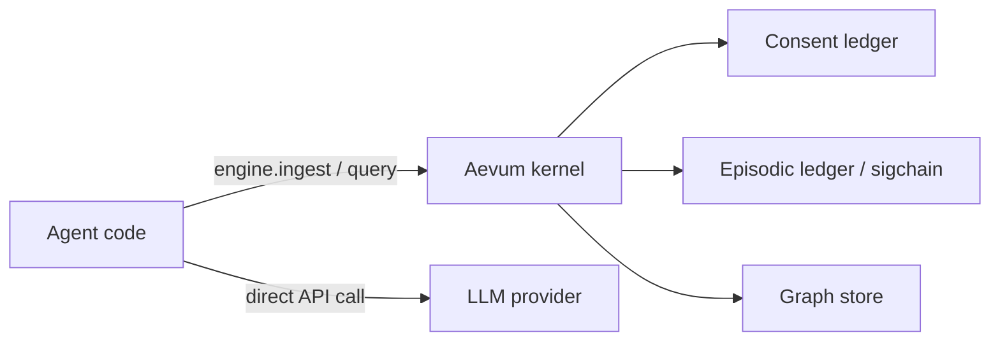
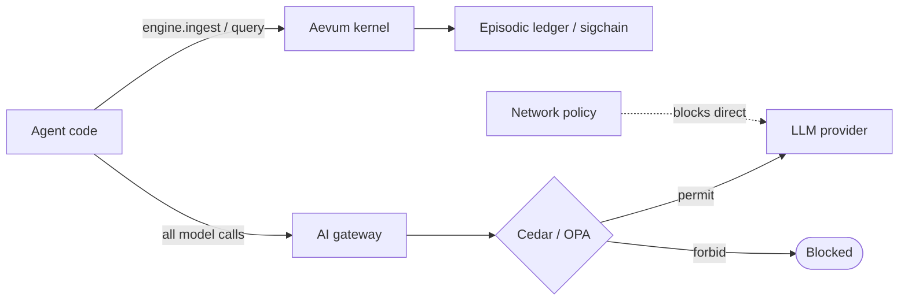
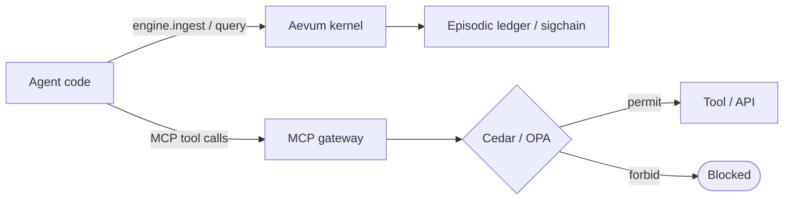

# Deployment Patterns

Aevum is an in-process Python library — a context kernel in the microkernel
sense: minimal stable mechanism (consent, provenance, sigchain, deterministic
replay) paired with externalized policy (Cedar, OPA). This means enforcement
operates at the application layer.

!!! note "Honest scope"
    No in-process library can own the syscall boundary the way an OS kernel
    does. Aevum's five barriers are unconditional *within* the kernel — but a
    developer who routes around the kernel routes around the barriers. The
    three patterns below progressively close that gap for production deployments.

## Pattern 1 — Standalone

Aevum runs in-process with your agent. All enforcement occurs within the
process boundary.

**Enforcement:** Auditable accountability. The episodic ledger is tamper-evident
and serves as compliance evidence under an ISO/IEC 42001-style "did you have
a process and follow it" audit posture. Enforcement is not mandatory against
code that bypasses the kernel entirely.

**When to use:** Internal accountability programs, development and staging,
compliance posture documentation, projects where an AI gateway is not yet
in place.



**Install:**
```bash
pip install aevum-core aevum-store-oxigraph
```

---

## Pattern 2 — Behind an AI gateway

An AI gateway sits between the agent process and all LLM providers. Network
policy restricts the agent so that direct LLM API calls are blocked — every
model invocation must traverse the gateway. Aevum runs in-process for consent
enforcement and sigchain capture.

**Enforcement:** Mandatory at the network level. The agent cannot reach a model
without traversing the gateway's policy engine. Aevum records the pre-call
context envelope (model identity, tool definitions, conversation ID) and the
consent grant that authorized the operation.

**When to use:** EU AI Act Article 12 high-risk deployments (enforcement
August 2026), SOC 2 PI1.2, production enterprise deployments where
non-compliance must be architecturally impossible rather than auditable.

**Compatible gateways:** agentgateway (Linux Foundation / Solo.io),
Kong AI Gateway, LiteLLM Proxy, Portkey, AWS Bedrock AgentCore Gateway.



**Aevum's role:** Captures and signs the pre-call context envelope before the
gateway call. Records the consent receipt. Provides deterministic replay of
any past decision from the immutable sigchain.

---

## Pattern 3 — Behind an MCP gateway

An MCP gateway sits on the path between the agent and all tool endpoints.
Cedar or OPA policy at the gateway determines whether each tool call is
permitted before execution. Aevum runs in-process for consent and sigchain.

**Enforcement:** Mandatory at the protocol level. The agent cannot reach a
tool without the gateway's policy engine returning permit.

**When to use:** Tool-using agents accessing regulated data (HIPAA, GDPR
Article 7), multi-agent systems, EU AI Act high-risk deployments where
tool calls touch personal data.

**Compatible gateways:** agentgateway (Linux Foundation / Solo.io),
AWS Bedrock AgentCore with Cedar policies, Traefik Hub MCP middleware,
Red Hat Kuadrant MCP Gateway.



**Aevum's role:** Records the consent grants that the gateway enforces at the
protocol level. Captures the pre-call tool invocation context and signs it
into the sigchain. Provides the audit trail for every permitted and denied
tool call via the IETF Agent Audit Trail export in `aevum-sdk`.

---

## Pattern comparison

| Property | Standalone | AI gateway | MCP gateway |
|---|---|---|---|
| Enforcement type | Auditable accountability | Mandatory (network) | Mandatory (protocol) |
| Can developer bypass? | Yes (direct API call) | No (network blocked) | No (protocol blocked) |
| EU AI Act Art. 12 | Good-faith posture | Full compliance | Full compliance |
| Setup complexity | Low | Medium | Medium |
| Works fully offline | Yes | Gateway-dependent | Gateway-dependent |
| Best for | Dev / internal audit | LLM governance | Tool-using agents |

## See also

- [Architecture](/learn/architecture/) — the five barriers and the sigchain
- [Security](/learn/security/) — threat model and security architecture
- [Standards Alignment](/learn/standards-alignment/) — regulatory mapping
- [Deployment](/learn/deployment/) — production configuration guide
